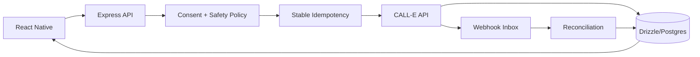

# CALL-E V4 API Integration Upgrade

This additive layer is designed for `lucylow/call-mobile-aunty`. It strengthens the server boundary around CALL-E rather than exposing the CALL-E API key to React Native.

## Architecture

## Runtime contract

1. The mobile client creates a local `clientRequestId`.
2. The app sends only application data to the server.
3. The server validates phone numbers and task shape.
4. The server creates a stable idempotency key.
5. The CALL-E API key remains server-side.
6. Structured schemas use explicit fields and `unknown` where evidence can be ambiguous.
7. Webhook events are deduplicated before state mutation.
8. The server can reconcile provider truth after missed webhook delivery.

## Hackathon alignment

The current Devpost rules require a functional application using CALL-E API/SDK/Skill/MCP, and the judges explicitly score real runtime CALL-E usage, technical implementation, real-world impact, and product experience. The hackathon also requires a pull request to `awesome-phone-call-agents` and a sub-three-minute demo.

## Real-call safety

Only run real calls against recipients you are authorized to contact. Do not use this layer to collect passwords, OTPs, payment credentials, or other authentication secrets. Keep production logs redacted.

## Integration steps

- Copy the V4 modules into the existing repository.
- Wire `createCalleRouter(service)` into the existing Express server.
- Instantiate `CalleProvider(loadConfig())` on the server.
- Replace `MemoryCallRepository` with the project's existing Drizzle repository.
- Add a webhook endpoint that passes the raw request body to `ingestEvent`.
- Add the mobile queue and status components to the existing call screen.
- Keep demo mode enabled for local UI work; use live mode only for authorized test calls.

## Suggested demo

Show: create task -> server validation -> CALL-E runtime call -> structured result -> status timeline -> reconciliation. This demonstrates the actual API integration instead of only showing a UI mock.
